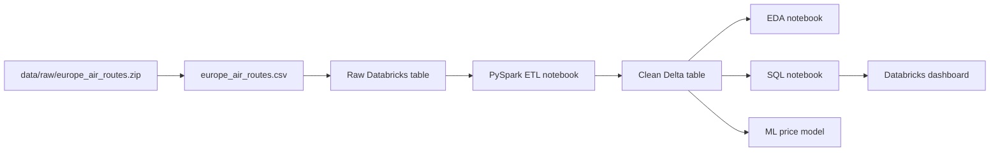

# Architecture

## Overview

This project uses Databricks as the primary analytics platform. The raw route CSV is registered as a raw table, transformed with PySpark, stored as a clean Delta table, queried with SQL, and consumed by a Databricks dashboard and machine learning workflow.

## Data Flow



## Table Design

Raw table:

```text
workspace.eu_air_routes.europe_air_routes_raw
```

Clean table:

```text
workspace.eu_air_routes.eu_air_routes_clean
```

## Key Transformations

- Cast numeric fields safely.
- Preserve string schedule columns before converting them into flags.
- Convert `day1` through `day7` into route-operation indicators.
- Derive `days_operated` and `is_daily_route`.
- Parse `flights_per_day` into a numeric approximation.
- Use latitude and longitude to calculate `distance_km`.
- Calculate `price_per_km` for pricing comparisons across route lengths.

## Analytics Layer

The SQL notebook produces route and country-level summaries for dashboarding:

- Busiest routes by weekly frequency
- Weekly flight volume by departure country
- Average price by distance bucket
- Daily operating routes
- Price-band distribution by country
